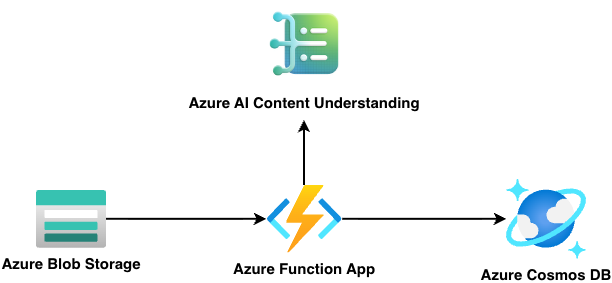

# Event Driven Document Processing Accelerator

| [](https://codespaces.new/Azure-Samples/call-center-voice-agent-accelerator) | [](https://vscode.dev/redirect?url=vscode://ms-vscode-remote.remote-containers/cloneInVolume?url=https://github.com/Azure-Samples/call-center-voice-agent-accelerator)
|---|---|

Welcome to the Event Driven Document Processing solution accelerator. It's a lightweight template to extract information from documents. This solution accelerator uses Azure Azure AI Content Understanding and Azure Functions.

Azure AI Content Understanding is a powerful solution for extracting structured insights from unstructured data. Designed for developers building intelligent automation workflows, it streamlines the process of analyzing content by unifying layout analysis, semantic extraction, and schema-driven interpretation into a single, cohesive interface. This eliminates the need for complex manual parsing or custom ML pipelines, enabling scalable, low-latency insight extraction across diverse formats. Whether you're working with documents, videos or audio files, Azure AI Content Understanding delivers high-quality results that integrate seamlessly into your business logic. 
</br>
[Learn more about Azure AI Content Understanding](https://actual-url-here.com).


<br/>

<div align="center">
  
[**Features**](#features) \| [**Getting Started**](#getting-started)  \| [**Resources**](#resources)

</div>

## Features

This accelerator helps simplify the extraction of information from documents.

The solution includes:

- An end-to-end pipeline triggered by the upload of documents to a blob storage
- Flexible configuration to customize schemas
- Easy integration with other architectures (just upload the document to the blob storage). Output binding can be easily swapped for your desired source

> You can also try Azure AI Content Understanding via the Azure AI Foundry UI for quick experimentation before deploying this template to your own Azure subscription.

### Architecture diagram



## Getting Started

### Prerequisites and Costs
To deploy this solution accelerator, ensure you have access to an [Azure subscription](https://azure.microsoft.com/free/) with the necessary permissions to create **resource groups and resources**. Follow the steps in [Azure Account Set Up](./docs/AzureAccountSetUp.md).

Check the [Azure Products by Region](https://azure.microsoft.com/explore/global-infrastructure/products-by-region/table) page and select a **region** where the following services are available: Azure AI Foundry Speech, Azure Communication Services, Azure Container Apps, and Container Registry.

Here are some example regions where the services are available: `westus`, `swedencentral`, `australiaeast`.
Pricing varies per region and usage, so it isn't possible to predict exact costs for your usage. The majority of the Azure resources used in this infrastructure are on usage-based pricing tiers.

Use the [Azure pricing calculator](https://azure.microsoft.com/en-us/pricing/calculator) to calculate the cost of this solution in your subscription.

| Product | Description | Cost |
|---|---|---|
| [Azure AI Content Understanding ](https://learn.microsoft.com/en-us/azure/ai-services/content-understanding/) | Extracts insights from unstructured content like documents, images, and videos using AI models | [Pricing](https://azure.microsoft.com/en-us/pricing/details/content-understanding/?msockid=2b189776556f650e3a1882ef5427649e) |
| [Azure Functions](https://learn.microsoft.com/en-us/azure/azure-functions/) | Serverless compute service that runs event-driven code without managing infrastructure | [Pricing](https://azure.microsoft.com/en-us/pricing/details/functions/?msockid=2b189776556f650e3a1882ef5427649e) |
| [Azure Cosmos DB](https://learn.microsoft.com/en-us/azure/cosmos-db/) | Globally distributed NoSQL database for scalable, low-latency data storage and access | [Pricing](https://azure.microsoft.com/en-us/pricing/details/cosmos-db/autoscale-provisioned/?msockid=2b189776556f650e3a1882ef5427649e) |
| [Azure Blob Storage](https://docs.azure.cn/en-us/storage/blobs/) | Object storage solution for unstructured data like documents, images, and backups | [Pricing](https://azure.microsoft.com/en-us/pricing/details/storage/blobs/?msockid=2b189776556f650e3a1882ef5427649e) |


Here are some developers tools to set up as prerequisites:
- [Azure CLI](https://learn.microsoft.com/cli/azure/what-is-azure-cli): `az`
- [Azure Developer CLI](https://learn.microsoft.com/azure/developer/azure-developer-cli/overview): `azd`
- [Python](https://www.python.org/about/gettingstarted/): `python`
- [UV](https://docs.astral.sh/uv/getting-started/installation/): `uv`
- Optionally [Docker](https://www.docker.com/get-started/): `docker`


### Deployment Options
Pick from the options below to see step-by-step instructions for: GitHub Codespaces, VS Code Dev Containers, Local Environments, and Bicep deployments.

<details>
  <summary><b>Deploy in GitHub Codespaces</b></summary>
  
#### GitHub Codespaces

You can run this solution using GitHub Codespaces. The button will open a web-based VS Code instance in your browser:

1. Open the solution accelerator (this may take several minutes):

    [](https://codespaces.new/Azure-Samples/call-center-voice-agent-accelerator)

2. Accept the default values on the create Codespaces page.
3. Open a terminal window if it is not already open.
4. Follow the instructions in the helper script to populate deployment variables.
5. Continue with the [deploying steps](#deploying).

</details>

<details>
  <summary><b>Deploy in VS Code Dev Containers </b></summary>

#### VS Code Dev Containers

You can run this solution in VS Code Dev Containers, which will open the project in your local VS Code using the [Dev Containers extension](https://marketplace.visualstudio.com/items?itemName=ms-vscode-remote.remote-containers):

1. Start Docker Desktop (install it, if not already installed)
2. Open the project:

    [](https://vscode.dev/redirect?url=vscode://ms-vscode-remote.remote-containers/cloneInVolume?url=https://vscode.dev/redirect?url=vscode://ms-vscode-remote.remote-containers/cloneInVolume?url=https://github.com/Azure-Samples/call-center-voice-agent-accelerator)


3. In the VS Code window that opens, once the project files show up (this may take several minutes), open a terminal window.
4. Follow the instructions in the helper script to populate deployment variables.
5. Continue with the [deploying steps](#deploying).

</details>

<details>
  <summary><b>Deploy in your local environment</b></summary>

 #### Local environment

If you're not using one of the above options for opening the project, then you'll need to:

1. Make sure the following tools are installed:

    * `bash`
    * [Azure Developer CLI (azd)](https://aka.ms/install-azd)

2. Download the project code:

    ```shell
    azd init -t Azure-Samples/call-center-voice-agent-accelerator/
    ```
    **Note:** the above command should be run in a new folder of your choosing. You do not need to run `git clone` to download the project source code. `azd init` handles this for you.

3. Open the project folder in your terminal or editor.
4. Continue with the [deploying steps](#deploying).

</details>
 
### Deploying

Once you've opened the project in [Codespaces](#github-codespaces) or in [Dev Containers](#vs-code-dev-containers) or [locally](#local-environment), you can deploy it to Azure following the following steps. 

To change the `azd` parameters from the default values, follow the steps [here](./docs/customizing_azd_parameters.md). 

1. Login to Azure:

    ```shell
    azd auth login
    ```

2. Provision and deploy all the resources:

    ```shell
    azd up
    ```
    It will prompt you to provide an `azd` environment name (like "flask-app"), select a subscription from your Azure account, and select a location (like "eastus"). Then it will provision the resources in your account and deploy the latest code. If you get an error with deployment, changing the location can help, as there may be availability constraints for some of the resources.

3. When `azd` has finished deploying, you'll see the resource group alongside resources in the Azure Portal.

4. When you've made any changes to the code, you can just run:

    ```shell
    azd deploy
    ```

>[!NOTE]
>AZD will also setup the local Python environment for you, using `venv` and installing the required packages.

## Resources
- [📖 Docs: Azure AI Content Understanding](https://learn.microsoft.com/azure/ai-services/speech-service/voice-live)
- [📖 Samples: Python code samples](https://github.com/Azure-Samples/azure-ai-content-understanding-python)
